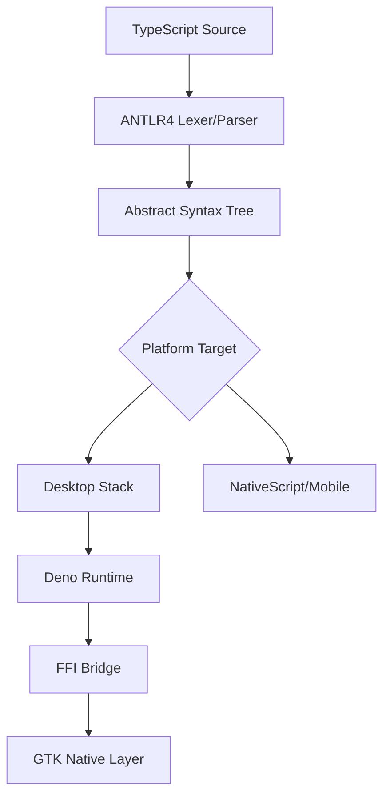
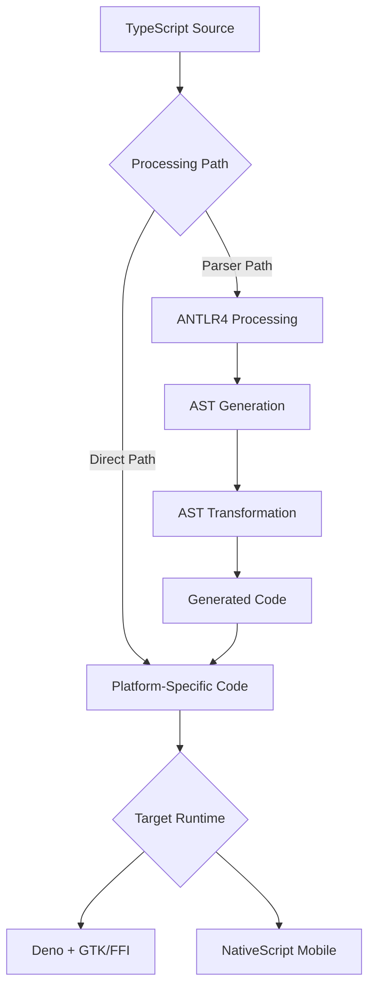
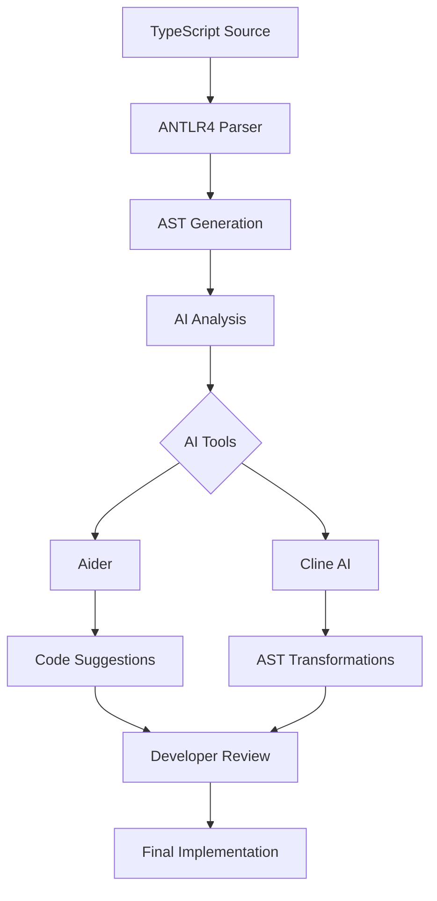

# TypeScript Development Stack Analysis

## Core Components

### TypeScript (Development Language)
- Statically typed superset of JavaScript
- Provides type safety and modern ECMAScript features
- Compiles to JavaScript for runtime execution
- Enables robust development with enhanced IDE support

### Deno (Desktop Runtime)
- Modern runtime for JavaScript/TypeScript
- Built-in TypeScript support without configuration
- Secure by default with explicit permissions
- Native ES Modules without package.json
- Built-in testing and formatting tools

### NativeScript (Mobile Parser)
- Translates TypeScript/JavaScript to native mobile code
- Direct access to native APIs
- Renders native UI components
- Enables code sharing between platforms
- Hot reload development support

### GTK (Desktop UI Framework)
- Native GTK bindings via Deno FFI
- Low-level access to GTK widgets through FFI calls
- Direct memory management and native API access
- High-performance C-level integration
- Direct FFI calls to system GTK4 libraries
- Integration with GNOME's libadwaita for modern UI
- Zero-overhead TypeScript-to-GTK bridge
- Custom FFI type definitions for TypeScript

### ANTLR4 (Parser Generator)
- Parser generator for reading, processing, and executing structured text
- Creates lexers and parsers from grammatical descriptions
- Generates Abstract Syntax Trees for code analysis
- Supports multiple target languages including TypeScript
- Enables sophisticated source code transformation

## Architecture Flow



## ANTLR4 Integration

ANTLR4 serves as the parsing foundation in this stack, providing several key benefits:

1. **Source Processing**
   - Tokenizes TypeScript source code
   - Generates Abstract Syntax Tree (AST)
   - Enables static analysis and transformation

2. **Cross-Platform Benefits**
   - Single grammar definition for multiple targets
   - Consistent parsing across desktop and mobile
   - Language-agnostic tree representation

3. **Development Workflow**



This workflow shows two paths:
1. Parser Path: Through ANTLR4 for code requiring parsing/transformation
2. Direct Path: Bypassing ANTLR4 for straightforward platform code

## Stack Benefits

1. **Type Safety**
   - TypeScript provides compile-time type checking
   - ANTLR4 ensures syntactic correctness
   - Strong typing across desktop and mobile

2. **Development Experience**
   - Modern JavaScript features via TypeScript
   - Deno's built-in tooling and FFI capabilities
   - Direct GTK integration through FFI
   - NativeScript's hot reload
   - ANTLR4's robust parsing capabilities

3. **Cross-Platform Consistency**
   - Shared business logic
   - Consistent parsing behavior
   - Native performance on all platforms
   - GTK native desktop experience
   - Unified UI/UX patterns

## Considerations

1. **Build Process**
   - ANTLR4 grammar maintenance
   - Platform-specific optimizations
   - Build time overhead for AST generation

2. **Development Setup**
   - ANTLR4 grammar development
   - FFI bindings maintenance
   - GTK version compatibility
   - Platform-specific debugging
   - Testing across environments

3. **Performance**
   - AST generation overhead
   - Memory usage for tree representation
   - Runtime performance considerations

## ANTLR4 Specific Workflow

1. **Grammar Definition**
   ```antlr
   // Example TypeScript grammar snippet
   program
    : statement*
    ;

   statement
    : variableStatement
    | functionDeclaration
    | classDeclaration
    ;
   ```

2. **Parse Tree Generation**
   - Lexical analysis of source code
   - Syntactic analysis using grammar rules
   - AST construction for further processing

3. **Tree Transformation**
   - Platform-specific visitors/listeners
   - Code generation for target platforms
   - Optimization opportunities

## AI Development Integration

### AI Development Tools

1. **Aider Integration**
   - AI-powered coding assistant
   - Real-time code suggestions and completion
   - Integrates with version control
   - Multi-model support:
     * OpenAI GPT-4 for complex reasoning
     * DeepSeek for specialized code generation
     * Anthropic Claude for detailed analysis
     * Gemini for multimodal understanding

2. **Cline AI Capabilities**
   - Native TypeScript/Deno integration
   - AST-aware code modifications
   - Intelligent refactoring suggestions
   - Model-specific features:
     * OpenAI: Advanced code completion and refactoring
     * DeepSeek: Performance optimization suggestions
     * Gemini: Visual component analysis
     * Anthropic: Architecture recommendations

### AI-Enhanced Development Workflow



### AI Integration Benefits

1. **Enhanced Development Speed**
   - Automated code generation
   - Intelligent refactoring suggestions
   - Quick prototype iteration
   - Context-aware completions

2. **Code Quality Improvements**
   - Pattern recognition
   - Best practice enforcement
   - Automated code review
   - Performance optimization suggestions

3. **Cross-Model Synergy**
   - OpenAI: Complex reasoning and architecture
   - DeepSeek: Specialized code optimization
   - Gemini: Visual and code understanding
   - Anthropic: Detailed analysis and explanation

### AI-ANTLR4 Synergy

1. **Intelligent Parsing**
   - AI-enhanced grammar suggestions
   - Automated AST optimization
   - Smart code transformation rules
   - Context-aware refactoring

2. **Development Automation**
   - Automated test generation
   - Smart error handling
   - Platform-specific optimizations
   - Code pattern recognition

## Conclusion

This stack provides a robust foundation for cross-platform development:

- TypeScript ensures type safety and modern development features
- Deno offers a secure and modern desktop runtime
- GTK delivers native desktop UI capabilities
- NativeScript enables native mobile development
- ANTLR4 provides the parsing infrastructure for consistent code processing

The integration of ANTLR4 is particularly valuable for:
- Consistent parsing across platforms
- Advanced static analysis capabilities
- Flexible transformation options
- Strong tooling support

This architecture enables efficient development while maintaining platform-specific optimizations and native performance.
